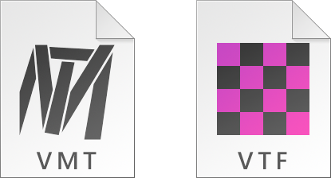

# Setup

Download the .zip file from the [GitHub](https://github.com/Gira-X/VMT-Editor/releases/latest) page and extract it anywhere on your computer.

## Set up games

Open the VMT Editor by clicking on `VMT_Editor.exe`. It should automatically detect Source games you have installed. Select a game from the game menu and you can start working.

If there are no games detected, navigate to _Games > Manage Games..._ dialog. Click on _Add_ button, then type in a name and browse for the game installation folder. This should be the folder with the file `gameinfo.txt`.

## Updating

VMT Editor automatically checks for updates and informs you in the _Message Log_. Download the update at the [GitHub releases](https://github.com/Gira-X/VMT-Editor/releases/latest) page. To update and keep your settings simply extract the .zip file in your current VMT Editor instalation directory. 

## Custom icons

Included in the `VMT_Editor.exe` are .vtf and .vmt icons you can use. To use them first make sure *VTFEdit* (not VMT Editor) is the default program for .vmt and .vtf files, launch VMT Editor in administrator mode, go to _Tools > Options_ and click _Change .vmt icon_ and _Change .vtf icon_ buttons. You can also add _Open in VMT Editor_ to context menu of .vmt files here.

You can also change the file icons using an external program or with the registry editor.
